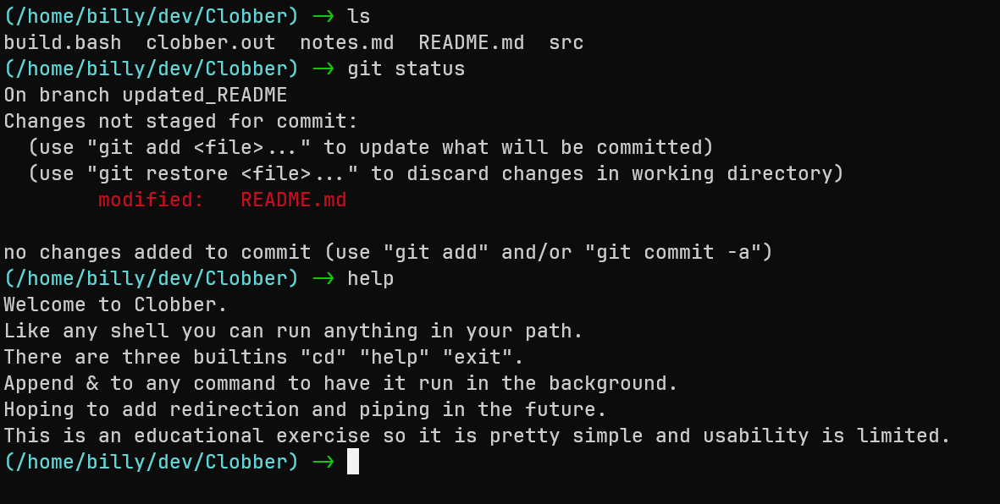

# Clobber

Simple unix shell. So named as clobber is a synonym of bash, how funny I know.

## Features

+ Run any program, support for the same programs as bash using *execvp* and forking.
+ Run programs in the background by appending "&", produces an output when the background job is exited.
+ Built-in programs "cd", "help" and "exit".
+ When a program is running in the foreground CTRL-C is redirected to close that program, otherwise CTRL-C 
causes Clobber to exit.

## Planned Features

+ Redirection with ">", ">>", "<" and "<<".
+ Piping with "|".
+ Non-interactive mode, i.e. running commands from files.

